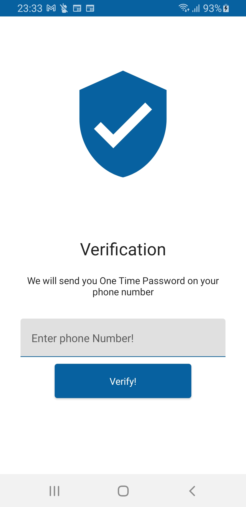

# MipMip
MipMip is an Android application designed to showcase the utilization of cutting-edge Android development tools and techniques. It leverages a range of modern technologies such as Kotlin, Coroutines, Dagger-Hilt, Jetpack Compose, MVVM architecture, Room database, Coil image loading library, and Firebase services. This sample messaging app serves as a practical demonstration of the capabilities offered by these tools in contemporary Android development.

- Create a firebase project and add google-services.json file which you get from your firebase project console
- - Following firebase services need to be enabled in the firebase console
  - Phone Auth
  - Realtime Database
  - Storage

  
  
  
  
  

## Features ✨
- Phone auth
- One on one chat
- Unread messages sign
- Profile Image
- Search users by contact name 

## Built With 🛠
- [Kotlin](https://kotlinlang.org/) - A statically typed, modern programming language that is fully interoperable with Java and simplifies Android development.
- [MVVM](https://developer.android.com/topic/libraries/architecture) - Pattern that allows the separation of the development of the graphical user interface from the business logic or back-end logic (the data model).
- [Coroutines & Flow](https://kotlinlang.org/docs/reference/coroutines-overview.html) - Coroutines provide a way to write asynchronous code sequentially, while Flow is a type that can emit multiple values sequentially, acting as a stream of data.
-  [Jetpack Compose](https://developer.android.com/topic/libraries/architecture/room) - SQLite object mapping library.
- [Navigation Component](https://developer.android.com/guide/navigation/navigation-getting-started) - Handle everything needed for in-app navigation with a single Activity.
- [ViewModel](https://developer.android.com/topic/libraries/architecture/viewmodel) - Stores UI-related data that isn't destroyed on UI changes. 
- [Room](https://developer.android.com/topic/libraries/architecture/room) - Room is an Android library that streamlines SQLite database management through object mapping..
- [Jetpack Compose](https://developer.android.com/jetpack/compose) - Jetpack Compose is Android’s recommended modern toolkit for building native UI. It simplifies and accelerates UI development on Android with less code, powerful tools, and intuitive Kotlin APIs.
- [Dependency Injection](https://developer.android.com/training/dependency-injection) - A technique whereby one object (or static method) supplies the dependencies of another object. It decouples the creation of a client's dependencies from its behavior, which allows program designs to be loosely coupled and to follow the dependency inversion and single responsibility principles.
  - [Dagger-Hilt](https://dagger.dev/hilt/) - Standard library to incorporate Dagger dependency injection into an Android application.
  - [Hilt-ViewModel](https://developer.android.com/training/dependency-injection/hilt-jetpack) - DI for injecting `ViewModel`.
- [Firebase](https://firebase.google.com/) - 
  - [Realtime Database](https://firebase.google.com/docs/database) - scalable NoSQL cloud database to store Users and Conversations Data  
  - [Cloud Storage](https://firebase.google.com/docs/storage) - For Store users images
  - [Authentication](https://firebase.google.com/docs/auth) - For Creating account with mobile number.
- [Coil-kt](https://coil-kt.github.io/coil/) - An image loading library for Android that simplifies image fetching, caching and display.
